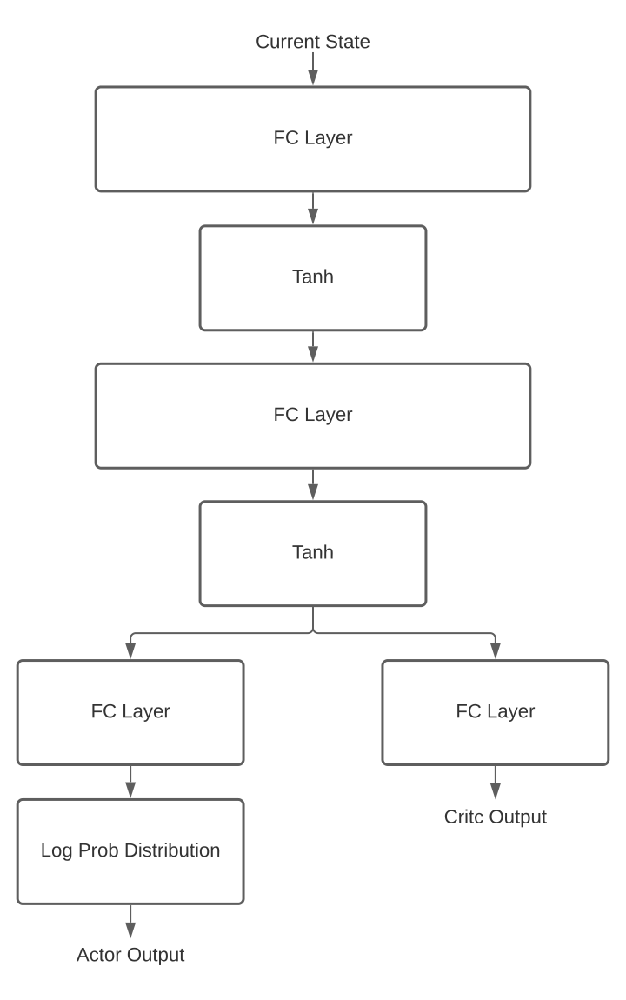

# Water Otter Crafter

This is code for a PPO2 model to solve the water otter crafts in Final Fantasy XIV. Implemented using pytorch.

Resourced used: https://github.com/openai/baselines

#### Block Diagram

